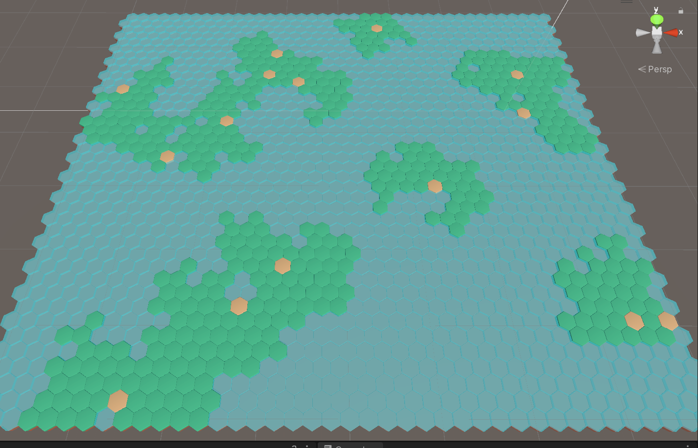
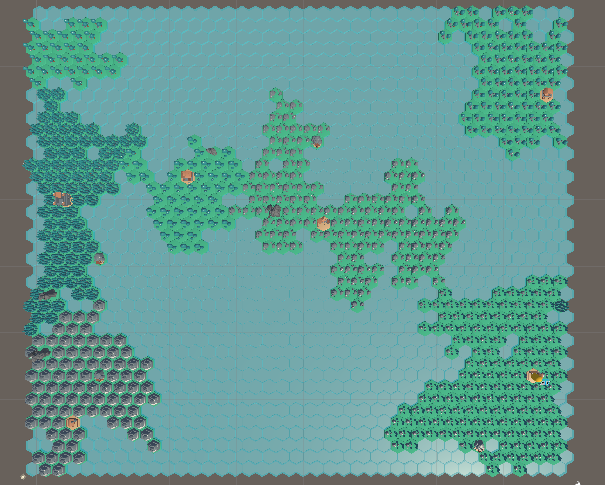
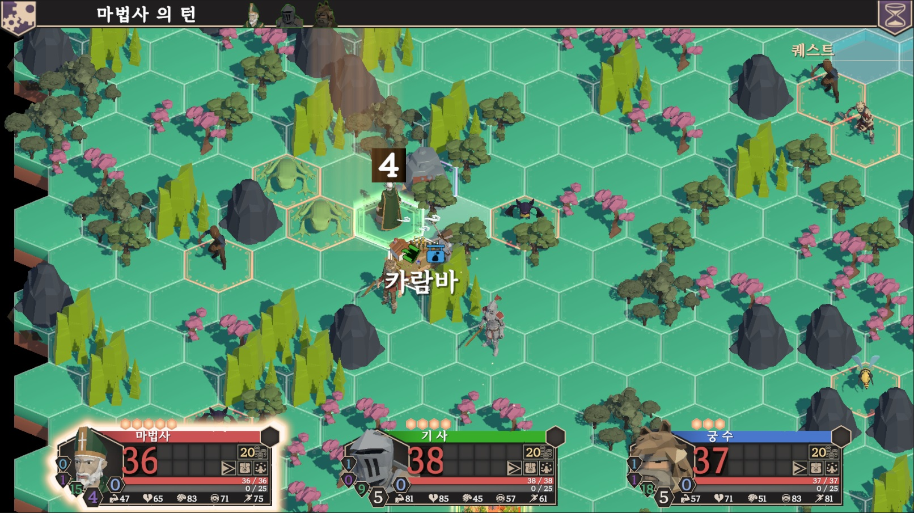
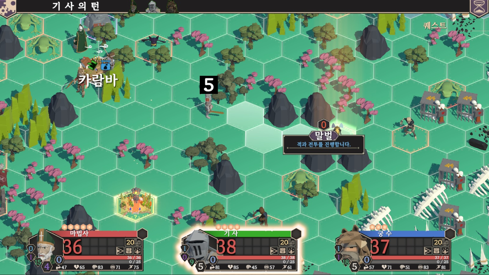

# 🧭 Hex-Based TRPG Tile Movement System

이 프로젝트는 TRPG 게임의 헥사 타일 기반 맵에서 **플레이어 이동, 경로 탐색, 맵 생성 및 시각적 피드백**까지 포함한 시스템을 구현한 것입니다. 비용 기반 BFS, 헥스 좌표 변환, 재귀 기반 맵 확장 등 게임 아키텍처 설계 및 알고리즘 최적화가 적용되어 있습니다.

---

## 📐 시스템 아키텍처

### 핵심 클래스 구성

| 클래스 | 역할 |
|--------|------|
| `MovementSystem` | 플레이어 이동 제어 및 범위/경로 하이라이트 처리 |
| `GraphSearch` | BFS 알고리즘, 비용 기반 경로 탐색 (Dijkstra 변형) |
| `HexGrid` | 타일 및 인접 정보 관리, 캐싱 |
| `HexCoordinates` | 실 좌표 ↔ 헥스 좌표 변환 |
| `Hex` | UI 연출, 이벤트 처리, 타입 분류 등 타일 개별 정보 보유 |

---

### 🔍 BFS 기반 탐색 알고리즘

```csharp
// 핵심: 비용 기반 BFS
while (nodesToVisitQueue.Count > 0)
{
    Vector3Int currentNode = nodesToVisitQueue.Dequeue();
    foreach (var neighbourPosition in hexGrid.GetNeighboursFor(currentNode))
    {
        if (skipObstacle && hexGrid.GetTileAt(neighbourPosition).IsObstacle())
            continue;

        int newCost = costSoFar[currentNode] + hexGrid.GetTileAt(neighbourPosition).GetCost;
        if (newCost <= movementPoints) // 이동 포인트 제한
        {
             // 더 효율적인 경로 발견 시 업데이트
            if (!visitedNodes.ContainsKey(neighbourPosition) || costSoFar[neighbourPosition] > newCost)
            {
                costSoFar[neighbourPosition] = newCost;
                visitedNodes[neighbourPosition] = currentNode;
                nodesToVisitQueue.Enqueue(neighbourPosition);
            }
        }
    }
}
```
✅ 장애물 회피 옵션 (skipObstacle)

✅ 이동 포인트 기반 제한

✅ 비용 기반 BFS (Dijkstra 변형)

---

### 🧭 헥스 좌표계 처리
```csharp
// 물리적 좌표와 논리적 좌표 변환
public static Vector3Int ConvertPositionToOffSet(Vector3 transformPosition)
{
    int x = Mathf.CeilToInt(transformPosition.x / xOffSet);
    int y = Mathf.RoundToInt(transformPosition.y / yOffSet);
    int z = Mathf.RoundToInt(transformPosition.z / zOffSet);
    return new Vector3Int(x, y, z);
}
```
- 짝수/홀수 Z축 기준 방향 계산

- Vector3 ↔ Hex 좌표 변환 로직 구현

---

### ⚙️ 성능 최적화 요소

🧠 BFS 결과 캐싱 (BFSResult)

🗂️ 인접 노드 캐싱 (_hexTileNeighboursDictionary)

```csharp
// BFS 결과 노드 구조체
public struct BFSResult
{
    public Dictionary<Vector3Int, Vector3Int?> VisitedNodesDictionary;
    public List<Vector3Int> GetPathTo(Vector3Int destination) { ... }
    public bool IsHexPositionInRange(Vector3Int position) { ... }
    public IEnumerable<Vector3Int> GetRangePositions() { ... }
}
```
---

### 🗺️ 맵 생성 시스템 (WorldMapGenerator)
#### 마을 기반 재귀형 맵 확장
```csharp
// 재귀적 지형 생성
private void SeedGrow(Hex hex, int storeIndex)
{
    for (int n = 0; n < frequency; n++)
    {
      // 마을 중심으로 자연스러운 지형 확장
        if (hex.Grow - 1 > 0)
        {
            newHex.Grow = hex.Grow - 1;
            SeedGrow(newHex, storeIndex); // 재귀 호출
        }
    }
}
```
🌱 마을 중심 → 자연스러운 주변 지형 확장

🎲 Seed 기반 랜덤 배치

---

### 🎨 시각적 피드백
```csharp
// 타일 경로 하이라이트 시스템
public void ShowPath(Vector3Int selectedHexPosition, HexGrid hexGrid)
{
    foreach (var hexPosition in _currentPath)
        hexGrid.GetTileAt(hexPosition).ResetHighlight();

    SetCurrentPath(_playerMovementRangeBFS.GetPathTo(selectedHexPosition));

    foreach (var hexPosition in _currentPath)
        hexGrid.GetTileAt(hexPosition).HighlightPath();
}
```
- 실시간 경로 하이라이트

- 마우스 진입/이탈 시 UI 팝업 처리

- 유저 상호작용 기반 시각적 강조

---
## 🎮 게임 이미지

| 맵 이동 타일 절차적 생성  | 이벤트 타일 생성 | 이동 범위 표시 |
|----------------|------------------|---------------|
| 
 |  |  |
